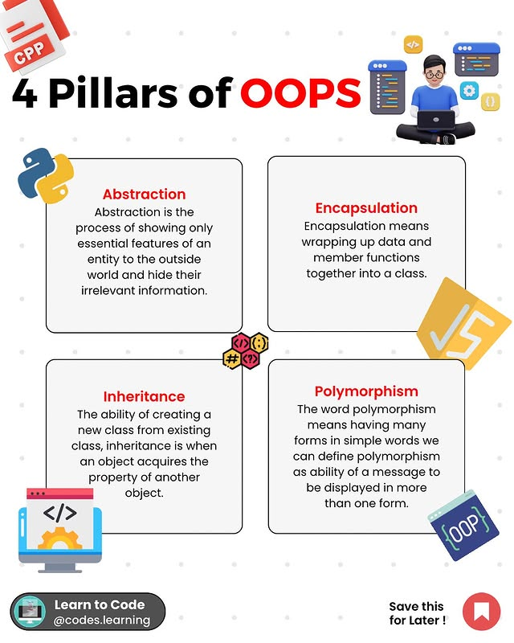

# Object-Oriented Programming (OOP) Pillars
Object-Oriented Programming (OOP) is a programming paradigm that uses objects and classes to structure software. It is built upon four main principles or pillars:

## 1. Encapsulation
- **Definition:** Encapsulation refers to the bundling of data (attributes) and the methods (functions) that operate on that data into a single unit, called a class. It hides the internal state and only exposes necessary methods to interact with the data.
- **Key Concept:** Data hiding. We control access to the data using access modifiers (private, protected, public), ensuring that the internal state is not directly exposed to the outside world.
Example: Using getter and setter methods to access private attributes.

## 2. Inheritance
- **Definition:** Inheritance is a mechanism by which a new class (subclass or derived class) can inherit attributes and methods from an existing class (superclass or base class).
- **Key Concept:** The subclass can extend or override the behavior of the parent class while reusing its properties.
Example: A Dog class inherits from the Animal class, gaining its attributes and methods.

## 3. Polymorphism
- **Definition:** Polymorphism allows objects of different classes to be treated as objects of a common superclass. The method to be invoked is determined at runtime (method overriding), enabling the same method to behave differently based on the object type.
- **Key Concept:** The ability to call the same method on different objects, and each object responds in its own way.
Example: The sound() method can behave differently for Dog and Cat classes.

## 4. Abstraction
- **Definition:** Abstraction is the process of hiding the implementation details and showing only the essential features of an object. It is achieved through abstract classes and interfaces.
- **Key Concept:** Abstract classes cannot be instantiated directly and are used to define a blueprint for other classes. It enforces the derived classes to implement certain methods.
Example: An abstract Shape class with an abstract area() method that must be implemented by all shapes like Circle or Square.

